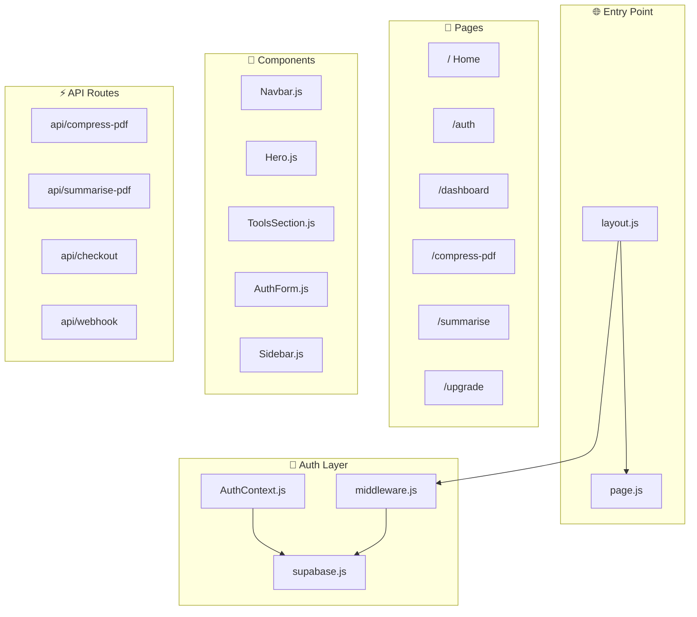
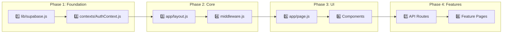
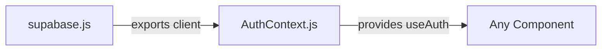
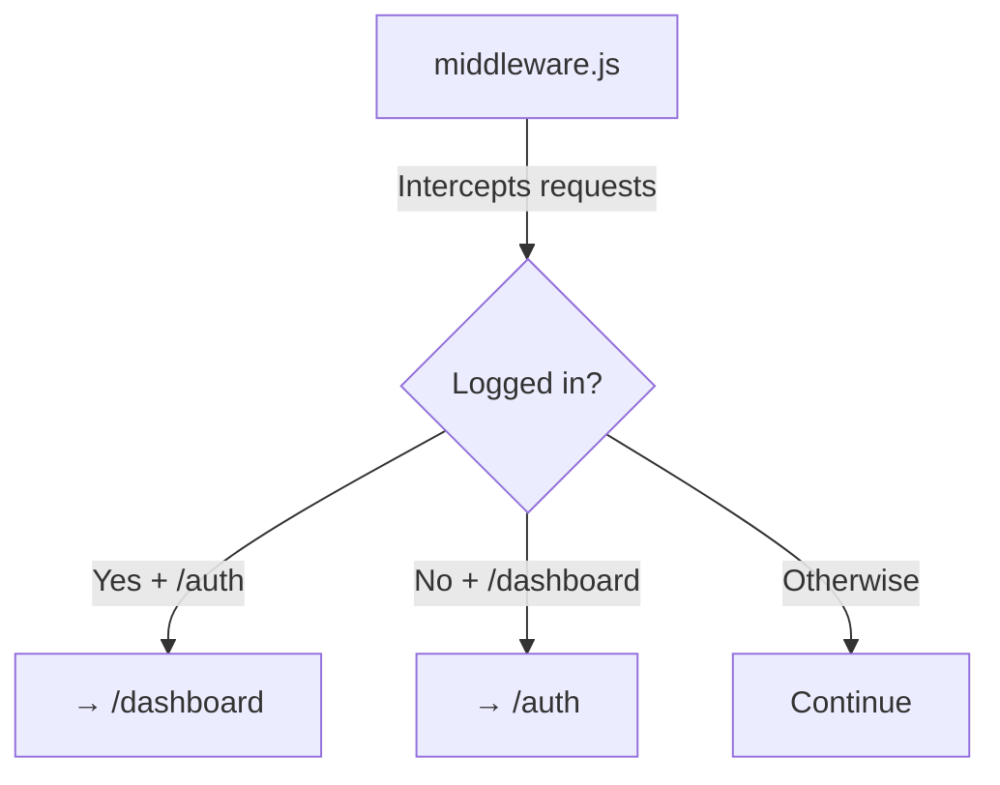
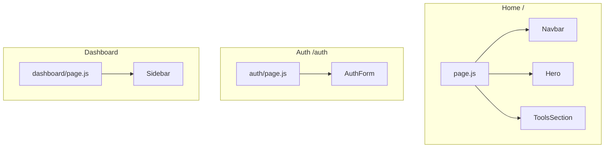
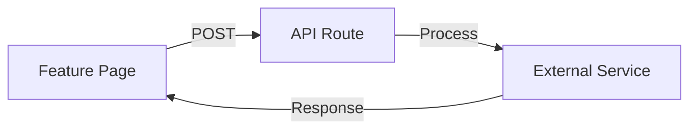
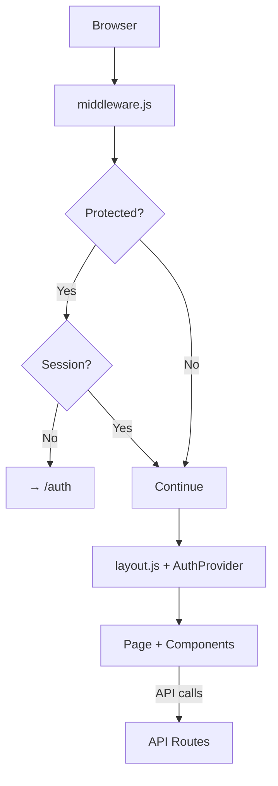

# 📚 DocFix Learning Roadmap

A complete guide showing how all files connect and the recommended learning path.

---

## 🗺️ High-Level Architecture



---

## 📖 Learning Order (4 Phases)



---

## 🔍 Phase 1: Database & Auth Foundation

| Order | File | Purpose | Key Concepts |
|:-----:|------|---------|--------------|
| 1️⃣ | `lib/supabase.js` | Database client | `createClient`, cookies, PKCE |
| 2️⃣ | `contexts/AuthContext.js` | Global auth state | React Context, `useAuth` hook |



---

## 🔍 Phase 2: App Core Structure

| Order | File | Purpose |
|:-----:|------|---------|
| 3️⃣ | `app/layout.js` | Root wrapper with AuthProvider |
| 4️⃣ | `middleware.js` | Route protection & redirects |



---

## 🔍 Phase 3: Pages & Components

| Order | File | Used In |
|:-----:|------|---------|
| 5️⃣ | `app/page.js` | Home `/` |
| 6️⃣ | `Navbar.js` | All pages |
| 7️⃣ | `Hero.js` | Home |
| 8️⃣ | `ToolsSection.js` | Home |
| 9️⃣ | `AuthForm.js` | Auth page |
| 🔟 | `Sidebar.js` | Dashboard |



---

## 🔍 Phase 4: API & Features

| File | Purpose |
|------|---------|
| `api/compress-pdf` | PDF compression |
| `api/summarise-pdf` | AI summarization |
| `api/checkout` | Stripe payment |
| `api/webhook` | Payment confirmation |



---

## 🔗 Complete Request Flow



---

## 📁 Directory Structure

```
DocFix/
├── app/
│   ├── layout.js          ← START HERE
│   ├── page.js            ← Home page
│   ├── auth/page.js       ← Login/Signup
│   ├── dashboard/page.js  ← User dashboard
│   ├── compress-pdf/      ← PDF tool
│   ├── summarise/         ← AI summary
│   ├── upgrade/           ← Premium
│   └── api/               ← Backend
│
├── components/            ← UI components
├── contexts/AuthContext.js ← Auth state
├── lib/supabase.js        ← DB client
└── middleware.js          ← Route guard
```

---

## ✅ Learning Checklist

- [ ] Phase 1: `supabase.js` → `AuthContext.js`
- [ ] Phase 2: `layout.js` → `middleware.js`
- [ ] Phase 3: `page.js` → Components
- [ ] Phase 4: API routes → Feature pages
